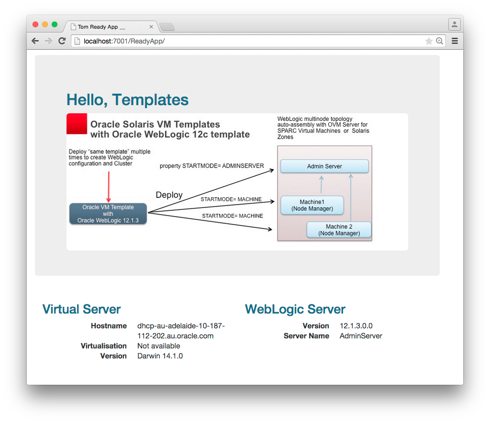

# TOM

This is a simple application that can be used to view the successful operation of a WebLogic Server topology when created using the Oracle Solaris Templates.

## Build and Deploy Manually

Build the application using the project pom.xml file then use the **WebLogic Server Console** or the `weblogic.Deployer` utility to deploy the `ReadyApp/target/ReadyApp.war` file.

    $mvn package
    
    [INFO] Scanning for projects...
    [INFO] ------------------------------------------------------------------------
    [INFO] Reactor Build Order:
    [INFO] 
    [INFO] ReadyApp
    [INFO] Templates
    [INFO]                                                                         
    [INFO] ------------------------------------------------------------------------
    [INFO] Building ReadyApp 1.0
    [INFO] ------------------------------------------------------------------------
           ...
    [INFO] 
    [INFO] --- maven-compiler-plugin:2.3.2:compile (default-compile) @ ReadyApp ---
    [INFO] Compiling 3 source files to /Users/sbutton/Projects/Java/TOM/ReadyApp/target/classes
           ...
    [INFO] 
    [INFO] --- maven-war-plugin:2.1.1:war (default-war) @ ReadyApp ---
    [INFO] Packaging webapp
    [INFO] Assembling webapp [ReadyApp] in [/Users/sbutton/Projects/Java/TOM/    ReadyApp/target/ReadyApp]
    [INFO] Processing war project
    [INFO] Copying webapp resources [/Users/sbutton/Projects/Java/TOM/ReadyApp/src/main/webapp]
    [INFO] Webapp assembled in [46 msecs]
    [INFO] Building war: /Users/sbutton/Projects/Java/TOM/ReadyApp/target/ReadyApp.war
    [INFO] WEB-INF/web.xml already added, skipping
    [INFO]                                                                         
    [INFO] ------------------------------------------------------------------------
    [INFO] Building Templates 1.0
    [INFO] ------------------------------------------------------------------------
    [INFO] ------------------------------------------------------------------------
    [INFO] Reactor Summary:
    [INFO] 
    [INFO] ReadyApp ........................................... SUCCESS [  2.115 s]
    [INFO] Templates .......................................... SUCCESS [  0.001 s]
    [INFO] ------------------------------------------------------------------------
    [INFO] BUILD SUCCESS
    [INFO] ------------------------------------------------------------------------
    [INFO] Total time: 2.199 s
    [INFO] Finished at: 2015-06-04T11:58:59+09:30
    [INFO] Final Memory: 19M/285M
    [INFO] ------------------------------------------------------------------------

## Build and Deploy with WebLogic-Maven-Plugin

First ensure you have the weblogic-maven-plugin:12.1.3-0-0 either installed in your local M2 repository or have the maven environment configured to use the Oracle Maven Repository.

+ [https://docs.oracle.com/middleware/1213/wls/WLPRG/maven.htm#WLPRG585](https://docs.oracle.com/middleware/1213/wls/WLPRG/maven.htm#WLPRG585)
+ [http://docs.oracle.com/middleware/1213/core/MAVEN/config_maven_repo.htm#MAVEN9010](http://docs.oracle.com/middleware/1213/core/MAVEN/config_maven_repo.htm#MAVEN9010)

Edit the ReadyApp/pom.xml and update the oracle* properties to match the target environment that the ReadyApp will be deployed to.

    <properties>
        <oracleUsername>weblogic</oracleUsername>
        <oraclePassword>welcome1</oraclePassword>
        <oracleAdminUrl>t3://localhost:7001</oracleAdminUrl>
        <oracleTarget>AdminServer</oracleTarget>
    </properties>

Execute the verify lifecycle phase which will compile, package then deploy the application using the weblogic-maven-plugin

    $ mvn verify
    
    [INFO] Scanning for projects...
    [INFO] ------------------------------------------------------------------------
    [INFO] Reactor Build Order:
    [INFO] 
    [INFO] ReadyApp
    [INFO] Templates
    [INFO]                                                                         
    [INFO] ------------------------------------------------------------------------
    [INFO] Building ReadyApp 1.0
    [INFO] ------------------------------------------------------------------------
           ...
    [INFO] 
    [INFO] --- maven-compiler-plugin:2.3.2:compile (default-compile) @ ReadyApp ---
    [INFO] Compiling 3 source files to /Users/sbutton/Projects/Java/TOM/ReadyApp/target/classes
           ...
    [INFO] 
    [INFO] --- maven-war-plugin:2.1.1:war (default-war) @ ReadyApp ---
    [INFO] Packaging webapp
    [INFO] Assembling webapp [ReadyApp] in [/Users/sbutton/Projects/Java/TOM/    ReadyApp/target/ReadyApp]
    [INFO] Processing war project
    [INFO] Copying webapp resources [/Users/sbutton/Projects/Java/TOM/ReadyApp/src/main/webapp]
    [INFO] Webapp assembled in [46 msecs]
    [INFO] Building war: /Users/sbutton/Projects/Java/TOM/ReadyApp/target/ReadyApp.war
    [INFO] WEB-INF/web.xml already added, skipping
    [INFO] 
    [INFO] --- weblogic-maven-plugin:12.1.3-0-0:deploy (deploy) @ ReadyApp ---
weblogic.Deployer invoked with options:  -noexit -deploy -user weblogic -name ReadyApp -source /Users/sbutton/Projects/Java/TOM/ReadyApp/target/ReadyApp.war -targets AdminServer -adminurl t3://localhost:7001
    <04/06/2015 12:09:53 PM ACST> <Info> <J2EE Deployment SPI> <BEA-260121>     <Initiating deploy operation for application, ReadyApp [archive: /Users/sbutton/Projects/Java/TOM/ReadyApp/target/ReadyApp.war], to AdminServer .> 
    Task 15 initiated: [Deployer:149026]deploy application ReadyApp on AdminServer.
    Task 15 completed: [Deployer:149026]deploy application ReadyApp on AdminServer.
    Target state: deploy completed on Server AdminServer

    [INFO]                                                                         
    [INFO] ------------------------------------------------------------------------
    [INFO] Building Templates 1.0
    [INFO] ------------------------------------------------------------------------
    [INFO] ------------------------------------------------------------------------
    [INFO] Reactor Summary:
    [INFO] 
    [INFO] ReadyApp ........................................... SUCCESS [  5.502 s]
    [INFO] Templates .......................................... SUCCESS [  0.001 s]
    [INFO] ------------------------------------------------------------------------
    [INFO] BUILD SUCCESS
    [INFO] ------------------------------------------------------------------------
    [INFO] Total time: 5.588 s
    [INFO] Finished at: 2015-06-04T12:09:53+09:30
    [INFO] Final Memory: 24M/349M
    [INFO] ------------------------------------------------------------------------

## Access the Application

The application will be accessible at the URL **http://server:port/ReadyApp**.  The ReadyApp will display information for the Virtual Server and the WebLogic Server instance it is running on.  If you deploy the application to a cluster targer it will display the name of the managed server being used.

    

